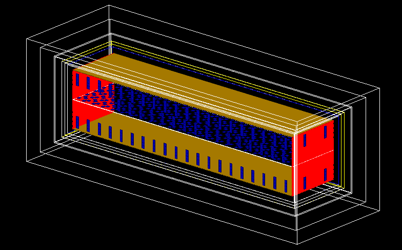

# Particle matter interaction simulatons with Geant4


## Getting started

Geant4 simulation project developed at LAPP to study low energy backgrounds in underground liquid argon detectors. A 10 kton DUNE like module is simulated. 



## How to use it

- It's highly recommended to use it in a cluster like lxplus, must, cc etc
- If you want to use it in your local computer you first need to install the geant4 software
- If you use it in lxplus you just need to connect to the cluster and then charge the required modules as indicated below

## How to use it in MUST
You just need to charge the environment with the required packages. Just put in a setup_g4.sh file the following lines
```
export MAMBA_ROOT_PREFIX=/mustfs/CONTAINERS/conda/neutrino/manzanilla
eval "$(/grid_sw/soft-dev-lapp/LAPPSL7/x86_64/micromamba/latest/micromamba shell hook -s posix)"
micromamba activate geant4
export CMAKE_PREFIX_PATH=/mustfs/CONTAINERS/conda/neutrino/manzanilla/envs/geant4/
```

Then you just have to do: 
```
source setup_geant4.sh

```
when you start a new session

## How to use it in LXPLUS
Put the following lines in a setup_geant4.sh file
```
# Modules:
source /cvmfs/sft.cern.ch/lcg/contrib/gcc/12/x86_64-centos9/setup.sh #set up compiler
source /cvmfs/geant4.cern.ch/geant4/11.1/x86_64-centos9-gcc12-optdeb-MT/CMake-setup.sh #set up environment for Geant4
export CXX=`which g++` #tell CMake about compiler used
export CC=`which gcc`

# ROOT library.
export LD_LIBRARY_PATH=$BOOST/lib:$LD_LIBRARY_PATH:$ROOT6/lib:$GEANT4/lib64:/usr/lib64/:/usr/lib

```

Then just source the file
```
source setup_geant4.sh

```
when you start a new session

## Some key numbers

Values are in cm. 

Cavern box filled with air starts at x= +/-3499.4, y= +/-1154.4, z= +/- 1099.4

start of shielding: x= +/- 3284.4, y= +/- 939.4, z= +/- 884.4
 
Shielding ends at x= +/-3294.4, y= +/-949.4, z= +/-894.4 (DEPENDING ON WHAT THICKNEES YOU CHOOSE!!!)

LAr Volume ends at x= +/-3100.0 y= +/-755.0, z= +/-700.0 

If you want to simulate neutrons from outside the coordinates of your source should be placed between the shielding and the rock of the cavern.
For instance in x, your x source coordinate should be smaller than 3499 and larger than 3295 (depending on the shielding thickness)

## Installing the sofwtware 

If is the first time that you are using it, you can just clone it by doing: 

```
git clone git@github.com:lmanzanillas/ULALAP.git

```
Then just creat a build file and do

```
mkdir build 
cd build
cmake ../ULALAP/ (or adjust in function where your code is)
make 

```
That should install the software. You can just run in the terminal: 
```
./ULALAP
```
That will show you the current geometry. To run an event just do: 
```
/run/beamOn 1
```
Then you can use a macro in batch mode (for example test.mac) if you are running thousands of events. To change the settings as energy and type of particle, etc just modify the test.mac file  

```

/run/beamOn 9000000


```

- Then you can run it from your build file 


```
./ULALAP -m test.mac

```
You can uncomment what is inside the test.mac file if you want to add or modify some setting

```
#/ULALAP/det/setOutputDirectory /nfs/tegile/work/experiences/detecteurs/manzanillas/LEAPS_INNOV/Geant4_output/
#/ULALAP/det/setDetectorName Name 
#/ULALAP/det/setDetectorType 5
#/ULALAP/det/setShieldingMaterial water_borated
#/ULALAP/det/setshieldingThickness 100 cm
#select output format, options are: csv root hdf5
#ULALAP/det/setDataType csv
/process/had/particle_hp/use_photo_evaporation true
/process/had/particle_hp/do_not_adjust_final_state true
/process/had/particle_hp/skip_missing_isotopes true
#uncoment if you want to use detector option 1 with shielding in the waffle
#/ULALAP/det/setDetectorType 1
#/ULALAP/det/setShieldingMaterialWaffle G4_WATER
#direction type, 0 constant direction given by vector, if 1 isotropic, 2 conical like direction sampling around given vector
#/ULALAP/gun/sourceDirectionType 1
#direction of the source
#/ULALAP/gun/direction -1 0 0
#position of the center of the source in cm for x y z
#/ULALAP/gun/position 10 20 30
#choise of the source: 0 for gamma, 1 for Fe55, 2 for Cs137, 3 for Bi207, 4 for Sr90, 5 for Am241, 6 for electron, 7 for optical_photon, 8 for neutron, 9 for gammas from neutron capture on argon, 10 for muons 
/ULALAP/gun/sourceType 9
#/ULALAP/gun/sourceEnergy 1.023 keV
#/ULALAP/gun/sourceEnergy 5.5 MeV
#geometry of the source: Sphere Cone Box point
#/ULALAP/gun/shape Box
#size of the box in cm for x y z
#/ULALAP/gun/BoxXYZ 100 200 300
#number of events
/run/beamOn 100000

```
This will create a set of .csv file or other format depending on what was your choice where it's stored the hits information, position of interaction, number of event, energy, etc 
You can use the code of your choice to analyze the data  

